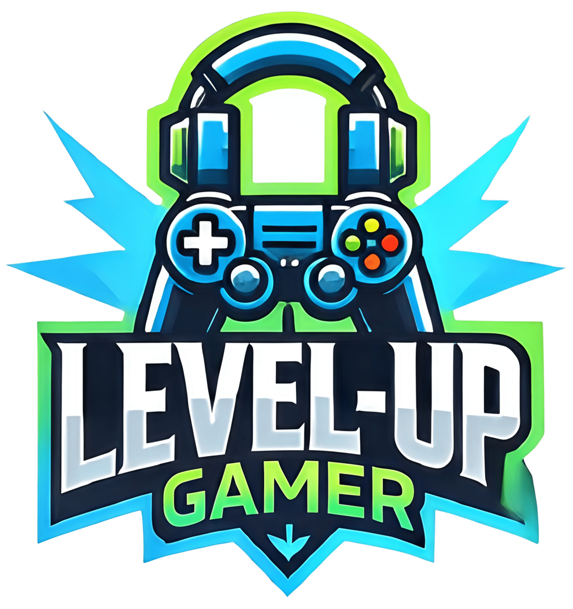

# 🎮 LEVEL-UP GAMER


## 📌 Descripción
**Level-Up Gamer** es una tienda online dedicada a satisfacer las necesidades de los entusiastas de los videojuegos en Chile.  
Nació como respuesta a la creciente demanda de productos gamer durante la pandemia, consolidándose como una alternativa confiable, moderna y accesible.  

El sitio ofrece un catálogo variado de consolas, videojuegos, accesorios, computadores y sillas especializadas, destacando por su **diseño atractivo, facilidad de uso y programa de fidelización basado en gamificación**.

---

## 🎯 Misión
Proporcionar productos gamer de alta calidad en todo Chile, ofreciendo una experiencia de compra única, segura y personalizada, con enfoque en la satisfacción del cliente y el crecimiento de la comunidad gamer.

---

## 🚀 Visión
Ser la tienda online líder en Chile, reconocida por:
- Innovación constante en la plataforma y catálogo.
- Servicio al cliente excepcional.
- Un sistema de gamificación que premie la fidelidad de nuestros clientes.

---

## 💡 Valores
- **Innovación** → Evolución constante con nuevas tecnologías.
- **Compromiso** → Priorizar la satisfacción de cada cliente.
- **Accesibilidad** → Precios competitivos y envíos a todo Chile.
- **Comunidad** → Crear un espacio donde los gamers se sientan parte de algo más grande.

---

## 👥 Público Objetivo
- Gamers casuales y hardcore.
- Estudiantes y profesionales que buscan equipos de alto rendimiento.
- Creadores de contenido que necesitan periféricos especializados.
- Comunidades gamer que buscan una tienda confiable.

---

## 🛠️ Funcionalidades
- **Catálogo dinámico** con filtros por categoría, marca y precio.  
- **Carrito de compras y checkout seguro**.  
- **Sistema de fidelización con gamificación**.  
- **Panel de administración** (gestión de productos y usuarios).  
- **Reseñas y calificaciones** en productos.  
- **Soporte en línea** y sección de contacto.  

---

## 🎨 Diseño Visual

### Colores
- **Fondo principal:** Negro `#000000`
- **Acentos:** Azul Eléctrico `#1E90FF` y Verde Neón `#39FF14`

### Tipografía
- **Texto principal:** [Roboto](https://fonts.google.com/specimen/Roboto)  
- **Encabezados:** [Orbitron](https://fonts.google.com/specimen/Orbitron)

### Texto
- **Principal:** Blanco `#FFFFFF`  
- **Secundario:** Gris Claro `#D3D3D3`  

---

## 📂 Estructura del Proyecto
Fullstack2/
├── index.html
├── src/
│ ├── admin/ # Panel de administración
│ ├── tienda/ # Páginas de la tienda
│ ├── assets/
│ │ ├── css/ # Estilos (admin.css, estilo.css)
│ │ ├── img/ # Imágenes y logos
│ │ └── js/ # Scripts (login, carrito, regiones, usuarios)

---

## 💻 Tecnologías Utilizadas
- **Frontend:** HTML5, CSS3, JavaScript  
- **Gestión de versión:** Git & GitHub  
- **Metodología:** Scrum  
- **Diseño:** UI/UX con enfoque en gamers (colores neón y futuristas)  

---

## 📥 Instalación y Ejecución
1. Clonar el repositorio:
   ```bash
   git clone https://github.com/BenjaminArellano/Fullstack2
